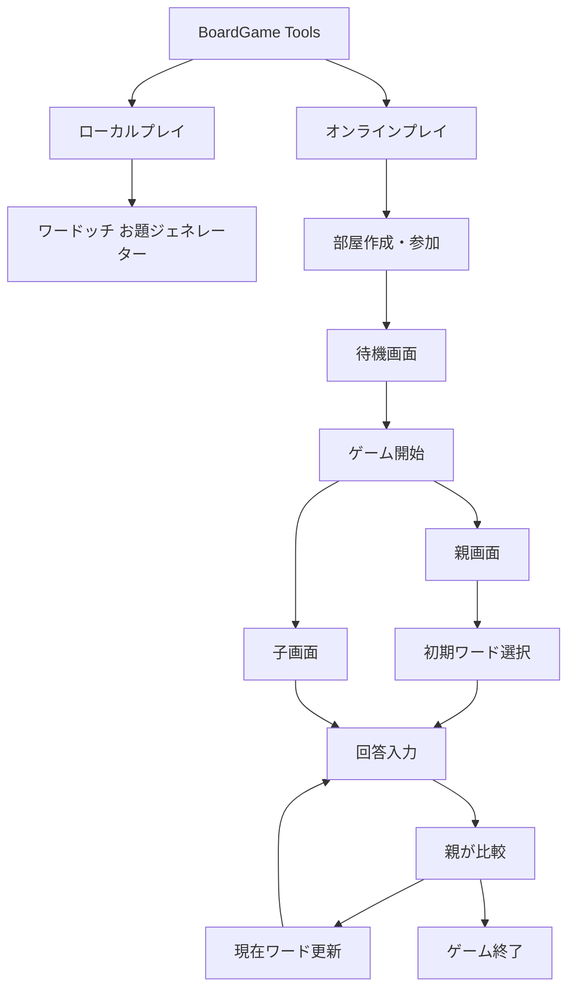

# BoardGame Tools 設計書

## 概要

BoardGame Tools は、ボードゲームをオンライン・オフライン問わず遊ぶためのWebアプリケーションである。

現在実装予定

- ワードッチ
- ito（予定）
- その他ボードゲーム（予定）

---

# システム構成



---

# ディレクトリ構成

```text
app
├── page.tsx
├── wordocchi
│   ├── page.tsx
│   └── room
│       └── page.tsx
│
├── ito
│
└── components
```

---

# 今後追加予定

- Supabase
- 部屋機能
- リアルタイム同期
- PWA