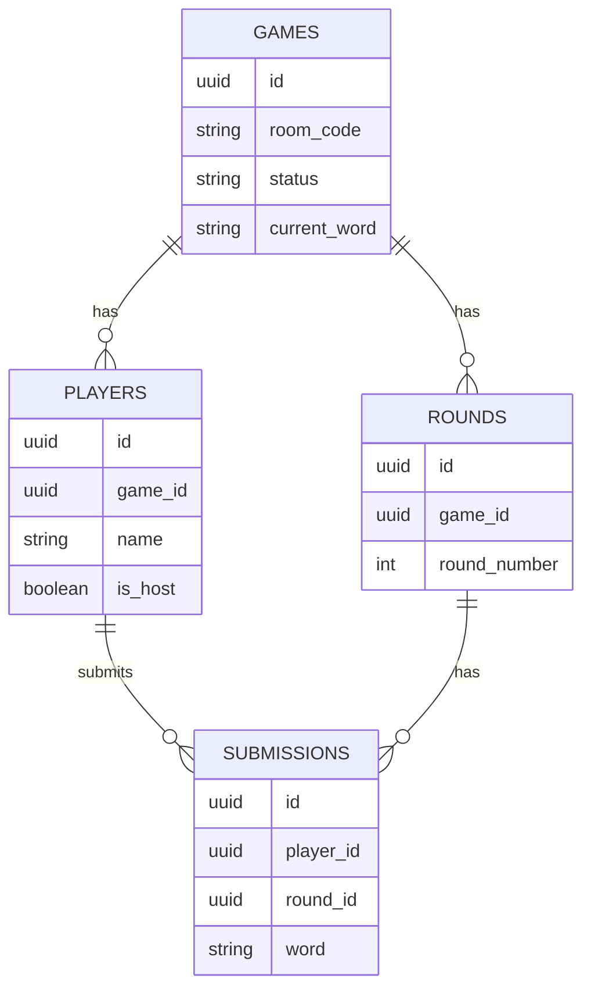

# データベース設計

```mermaid
erDiagram
    GAMES ||--o{ PLAYERS : has
    GAMES ||--o{ ROUNDS : has
    PLAYERS ||--o{ SUBMISSIONS : submits
    ROUNDS ||--o{ SUBMISSIONS : has

    GAMES {
        uuid id
        string room_code
        string status
        string current_word
    }

    PLAYERS {
        uuid id
        uuid game_id
        string name
        boolean is_host
    }

    ROUNDS {
        uuid id
        uuid game_id
        int round_number
    }

    SUBMISSIONS {
        uuid id
        uuid player_id
        uuid round_id
        string word
    }
```