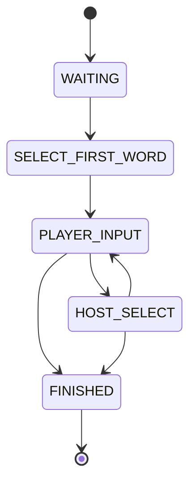

# ワードッチ 状態遷移

```mermaid
stateDiagram-v2

[*] --> WAITING

WAITING --> SELECT_FIRST_WORD

SELECT_FIRST_WORD --> PLAYER_INPUT

PLAYER_INPUT --> HOST_SELECT

HOST_SELECT --> PLAYER_INPUT

PLAYER_INPUT --> FINISHED

HOST_SELECT --> FINISHED

FINISHED --> [*]
```

---

## WAITING

参加者を待つ

---

## SELECT_FIRST_WORD

親が候補3つから最初のワードを選ぶ

---

## PLAYER_INPUT

子プレイヤーが回答する

---

## HOST_SELECT

親がどちらが近いかを選ぶ

---

## FINISHED

ゲーム終了